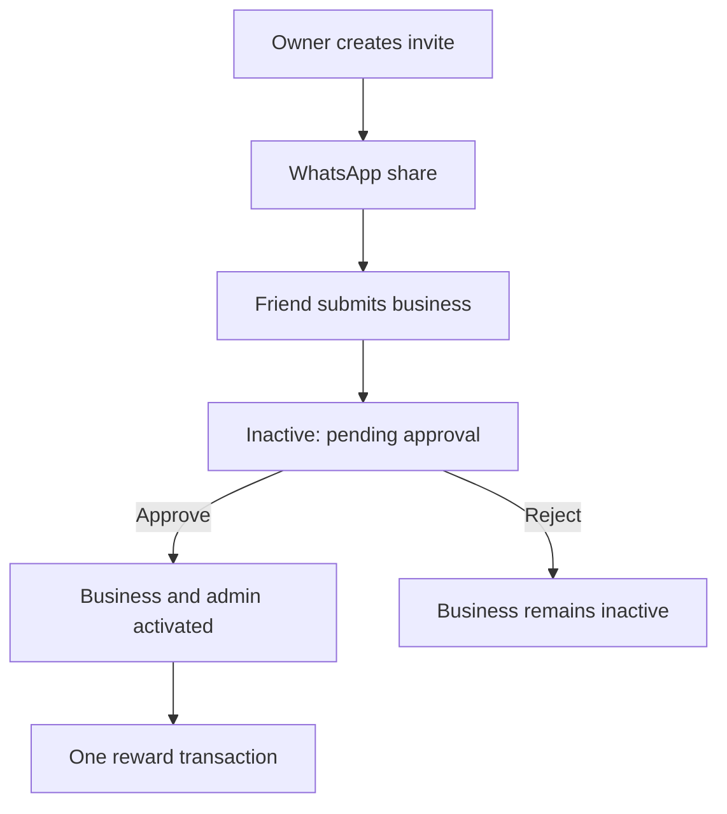

# Profiler Platform — Production Guide

## What this upgrade implements

- Public Justdial-style discovery by category, city, and business name.
- A dedicated page for every approved business, available by slug and subdomain.
- Super-admin approval for direct registrations and referred registrations.
- WhatsApp-only friend invitations using a phone-bound, expiring token.
- Referral rewards released exactly once and only after approval.
- A tenant-scoped page CMS for hero slides and scheduled promotional banners.
- Existing tenant-scoped editors for services, products, gallery, testimonials,
  payment QR, visiting card, enquiries, and WhatsApp settings.
- Data-driven subscription plans and unlimited organization-specific team roles.
- A cache-friendly JSON endpoint at `/org/<slug>/content.json`.

The WhatsApp invite flow opens a prepared `wa.me` conversation for the business
owner to send. Fully automatic WhatsApp delivery requires a separately approved
Meta WhatsApp Business account and templates.

## First run

Use Python 3.12 or newer and create a fresh virtual environment. Do not reuse the
Windows virtual environments that were present in the old archive.

```bash
python -m venv .venv
source .venv/bin/activate
pip install -r requirements.txt
cp .env.example .env
mysql -u root -p -e "CREATE DATABASE IF NOT EXISTS profiler CHARACTER SET utf8mb4 COLLATE utf8mb4_unicode_ci;"
python manage.py migrate
python manage.py runserver
```

On Windows, activate with `.venv\Scripts\activate` instead.
The first platform-level administrator can be created from the protected
Super Admin setup URL. After that, the route is locked for normal users.

## Production architecture

The included MySQL configuration is suitable for local development. A
million-user deployment needs
multiple layers:

1. A CDN and object storage for logos, hero images, product images, and PDFs.
2. A load balancer in front of multiple stateless Django/Gunicorn instances.
3. Managed MySQL with connection pooling, backups, query monitoring, and read
   replicas as traffic grows.
4. Redis for shared caching, sessions, rate limits, and short-lived discovery
   results.
5. Celery or another queue for emails, notification fan-out, analytics events,
   image optimization, and other slow jobs.
6. OpenSearch/Elasticsearch when directory search grows beyond what indexed
   MySQL search can serve comfortably.
7. Monthly partitioning or an external event store for `PageView` and
   `AnalyticsEvent` tables at high traffic.

The included database indexes, bounded public JSON responses, 60-second public
cache headers, tenant filters, and persistent database connections are a solid
application foundation. They do not replace load testing and production
infrastructure.

## Security checklist

- Set every deployment value in `.env.example`; never commit `.env`.
- Replace the local MySQL root credentials in `project/settings.py` with a
  least-privilege production database account.
- Rotate the Gmail app password that existed in the old source archive.
- Use HTTPS and set `DJANGO_DEBUG=False`.
- Restrict `DJANGO_ALLOWED_HOSTS` to real domains.
- Put media uploads in object storage and validate file size/type at the edge.
- Add per-IP and per-account rate limits to login, signup, invite, enquiry, cart,
  analytics, and payment endpoints.
- Verify PayPal webhooks server-to-server before activating a plan.
- Back up MySQL and uploaded media independently.

## Deployment commands

```bash
python manage.py check --deploy
python manage.py migrate
python manage.py collectstatic --noinput
gunicorn project.wsgi:application --workers 4 --threads 2 --timeout 60
```

Worker counts are a starting point only. Tune them from load-test results and
autoscale horizontally.

## Referral state flow


